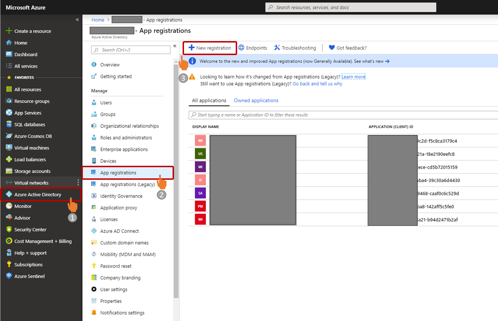
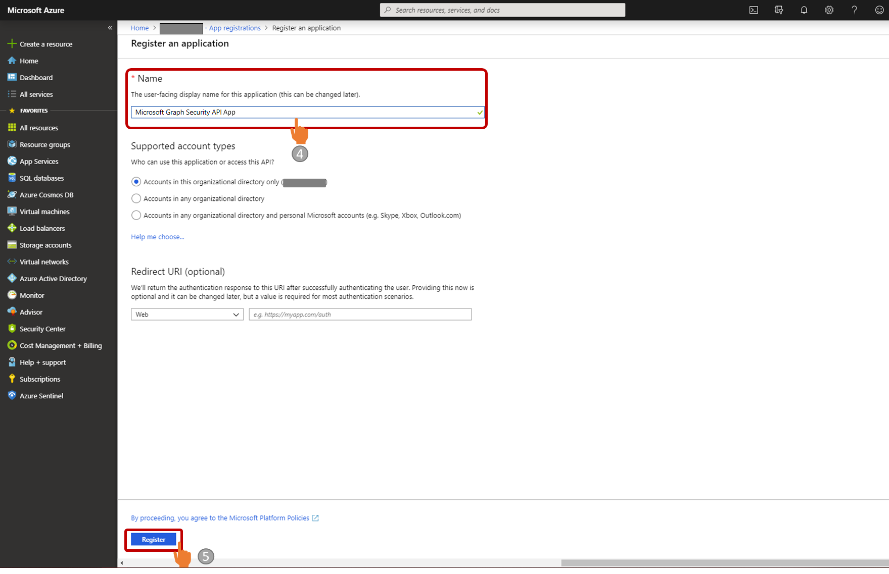
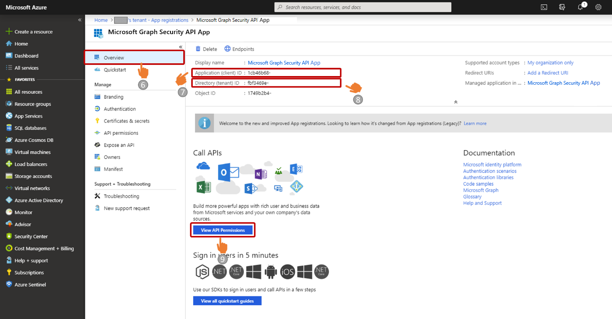
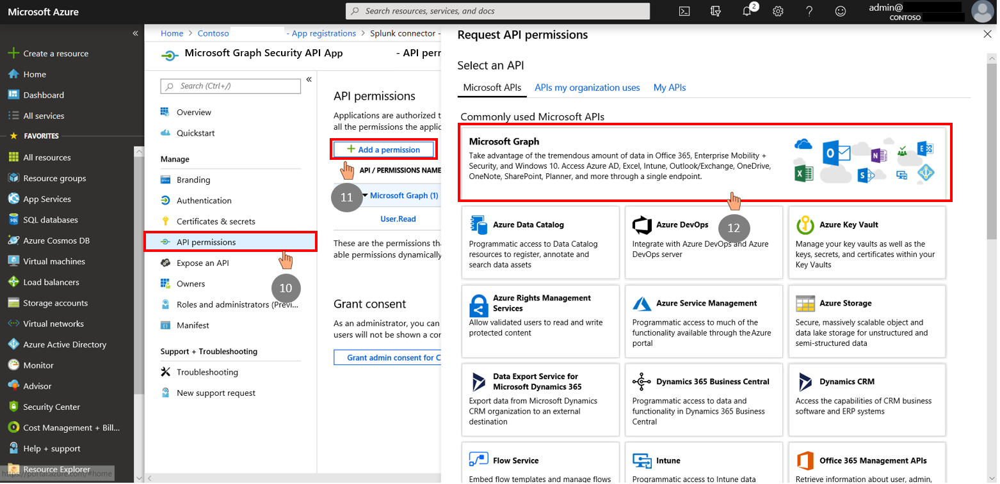
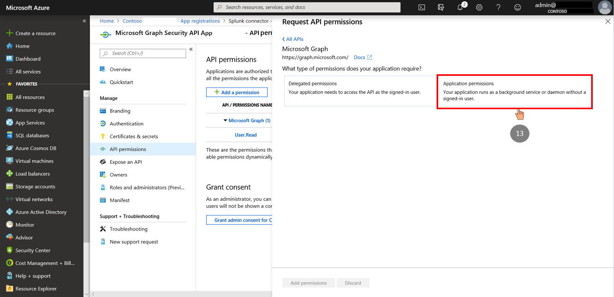
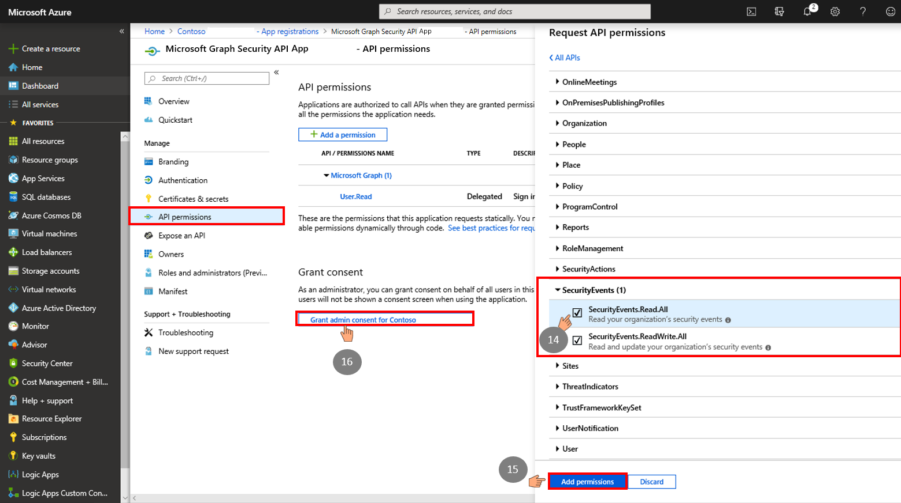
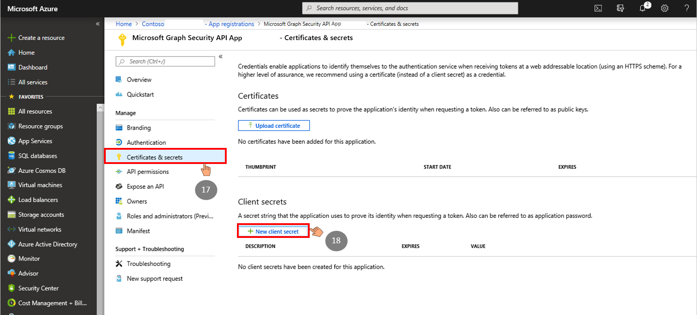

## Register a new application for Microsoft Graph Security API

These steps are needed to authenticate with the Microsoft Graph Security API.
Follow these steps to register a new application:  

1. Sign in to the [Azure Portal](http://portal.azure.com) with your work or school account. *Note: this stage does not require an AAD tenant admin.*
2. Select **Azure Active Directory** (1).
3. Select **App registrations** (2).
4. Select **New registration** (3).

    

5. In the new registration form that opens, enter an application name (4).
6. Select **Register** (5).

    

7. Next, you'll see the **overview page** and your app ID (7), and Directory (tenant) ID (8). Copy and save these fields. You will need them later to complete the configuration process.
8. Click on **View API Permissions** (9) to display the Graph permissions screen.

    

9. In the **API Permission screen**, click on the **Add a permission** button (11) and select  **Microsoft Graph** (12).

    

10. Next, select **Application permissions** (13) in the Request API permission pane that opens.

    

11. Under **Request API permissions**, select **SecurityEvents.Read.All** (14). Then click **Add permissions** (15).

    >**Note:** The following steps must be completed by the Azure Active Directory tenant admin.

12. Login to the Azure Portal as the Azure Active Directory Tenant Administrator for your organization and navigate to App registration/API permissions screen. Click on **Grant admin consent for the AAD tenant** (16).

    

13. Under **Certificates & secrets** (17), choose **New client secret** (18). A new secret will be displayed in the Value column. Copy this password – this is the only time you’ll be able to. You will need it later to complete the configuration process.

    
